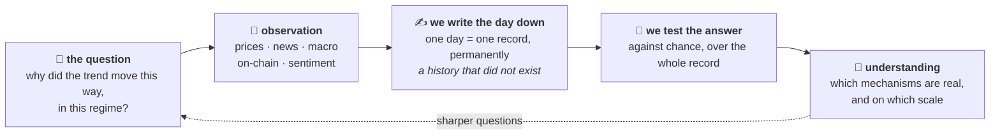

← [START HERE](../START%20HERE.md)

# 🔭 Why this exists

> [!IMPORTANT]
> **We are looking for answers.**
>
> Not for predictions, not for a system that acts on our behalf. For an answer to
> one question, asked again every day: **why did the trend move in this direction,
> in this market regime — and what was happening behind the scenes?**

---

## The obsession underneath

Markets never stop changing. What explained last quarter stops explaining this one,
and usually nobody can say exactly when it stopped or why. Explanations arrive
afterwards, confidently, and cannot be checked.

So the project asks a narrower question, on purpose:

> ### Why is this trend moving in this direction, in this regime — and what is happening behind the scenes?

What makes a move start. What sustains it. What kills it. Which levers are being
pulled, by whom, and where capital goes when it leaves somewhere else. Whether a
mechanism visible over twenty minutes is also visible over twenty weeks — weaker,
noisier, but recognisably the same thing.

That is the subject. Everything else here is instrumentation built to study it.

---

## ✍️ And we write it down — that is the other half

An answer that is not recorded is a story. Stories about markets are free, infinite,
and impossible to check a year later.

> **So we write. Day after day, we build a history that did not exist before.**

Every passing day is recorded as a **single image** — not only what the price did,
but what the world looked like while it did it: the macro backdrop, the flows, the
mood, what was known and what was not. Written once, in the moment, and kept
permanently.

This is the actual product of the project. Not a conclusion — **a record**, honestly
kept, against which future conclusions can be tested.

---

## Why an answer must be testable

The reason the project builds measuring instruments at all is that an untestable
explanation is worthless — however good it sounds.

So a proposed answer is turned into something that can **come back negative**:
measured over the whole accumulated record, compared against what chance alone
would produce, and corrected for the fact that many questions are being asked at
once.

| Without measurement | With it |
|---|---|
| "this reflects seller exhaustion" | a claim that can be **refuted** |
| plausible, unfalsifiable | compared against a baseline, over the whole history |
| accumulates opinions | accumulates **statistics** |

And the measuring instrument was built so that it **can say "no edge"** — an answer
treated here as a success. It has already returned that verdict on a mechanism this
project previously believed in, and the belief was dropped. See
[The v2 validation engine](../04%20%E2%80%94%20THE%20ENGINEERING/The%20v2%20validation%20engine.md).

> A system that appears to work without knowing why is luck with good marketing —
> and it teaches nothing you can carry into the next regime.

---

## ⏳ Why the record is kept forever

This is where the philosophy turns into a decision with consequences.

> **Prices can be re-downloaded at any time. The explanation of a day cannot.**

Price series are a commodity. What the world looked like *while* those prices
happened is written once and can never be reconstructed — not because the data is
gone, but because hindsight rewrites it silently and convincingly, and every check
made against a rewritten record is meaningless.

A daily record weighs a few kilobytes; a century of them weighs less than one day of
raw price data. There is no storage argument against keeping everything, which is
exactly why it is worth being strict about: the only way to lose the record is by
deciding to.

What it eventually makes possible:

> *"Find me the days whose macro image resembles today's — how did this mechanism
> behave then?"*

That question cannot be asked today. It can only be asked by someone who started
writing years earlier, honestly, before knowing which parts would matter.

Full detail: [The golden archive](../02%20%E2%80%94%20THE%20RESEARCH/The%20golden%20archive.md).

---

## The independent picture

A related commitment, and the reason much of this is done the hard way:

> *"No matter what other analysts say, we keep our own statistics and build our own
> trends, curves, diagrams, vectors and indices, on our own defined principles. In
> time we will have an independent picture of the market, defined by our own
> analysis."*

Someone else's analysis is a **hypothesis, not a truth**. It enters as an observation
with a date and a source; it never overrides a measurement and never confirms one.

After a year of honestly kept statistics, this project has something no vendor sells:
**a picture whose construction is fully known — including where it lies.** A picture
assembled from other people's conclusions looks finished on day one and cannot be
checked on any day after that.

More: [Principles](Principles.md).

---

## What this means for the reader

If you are here for predictions, a system to copy, or someone else's conviction —
there is nothing for you here, and that is by design.

If you are interested in **how someone tries to understand a system that refuses to
hold still** — how you build an instrument that can prove you wrong, how you record
today so that a question five years from now has something honest to land on, and
how you keep the whole thing from quietly contradicting itself — then that is what
the rest of this is.

---

## 🔗 Where to go next

| If you want | Go to |
|---|---|
| the record that all of this serves | [The golden archive](../02%20%E2%80%94%20THE%20RESEARCH/The%20golden%20archive.md) · [The daily file](../02%20%E2%80%94%20THE%20RESEARCH/The%20daily%20file.md) |
| what is being studied right now | [Market regimes](../02%20%E2%80%94%20THE%20RESEARCH/Market%20regimes.md) · [Smart money track](../02%20%E2%80%94%20THE%20RESEARCH/Smart%20money%20track.md) |
| how an answer is tested honestly | [The v2 validation engine](../04%20%E2%80%94%20THE%20ENGINEERING/The%20v2%20validation%20engine.md) |
| what the project explicitly is *not* | [What ORBITRON is not](What%20ORBITRON%20is%20not.md) |
