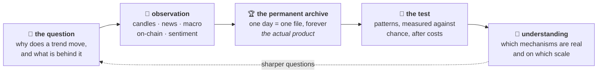

← [START HERE](../START%20HERE.md)

# 🔭 Why this exists

> [!IMPORTANT]
> **Read this before anything else**
>
> **ORBITRON is not a trading bot.**
>
> It is an attempt to understand how markets actually work — and trading is the
> instrument that makes the attempt honest, not the purpose it serves.

---

## The obsession underneath

Markets never stop changing. The thing that worked last quarter stops working, and
usually nobody can say exactly when it stopped or why. Explanations arrive
afterwards, confidently, and cannot be checked.

The question that drives this project is not *"what will the price do"*. It is:

> ### Why is this trend moving in this direction — and what is happening behind the scenes?

What makes a move start. What sustains it. What kills it. Which levers are actually
being pulled, by whom, and where the money goes when it leaves somewhere else.
Whether a mechanism that shows up in twenty minutes also shows up in twenty weeks,
weaker and noisier but recognisably the same thing.

That is the subject. Everything else in this vault is machinery built to study it.

---

## Then why is there trading in here at all

Because an explanation you cannot test is a story, and stories about markets are
free and infinite.

**Paper trading is the laboratory instrument.** It converts a claim about mechanism
into something that either survives contact with reality or doesn't:

| Without it | With it |
|---|---|
| "this pattern reflects seller exhaustion" | a measurable claim that can come back **negative** |
| plausible, unfalsifiable | compared against a baseline, after costs, with a correction for multiple testing |
| accumulates opinions | accumulates **statistics** |

A pattern that earns money is **evidence that some mechanism was understood
correctly**. That is the only reason profit interests this project at all. A system
that wins without knowing why is luck with good marketing, and it teaches nothing
you can carry to the next regime.

The measuring instrument was therefore built so it can say **"no edge"** — and that
answer is a success. It has already returned that verdict on a pattern this project
had previously believed in. See [The v2 backtest engine](../04%20%E2%80%94%20THE%20ENGINEERING/The%20v2%20backtest%20engine.md).

---

## What is actually being built, in one line

> **A permanent, honestly kept record of what markets did and what the world looked
> like while they did it — and a set of instruments for asking that record hard
> questions.**

The record is the point. Everything else serves it:

Trading sits inside the box marked *the test*. It is one box.

---

## ⏳ Why an archive, and why forever

This is the part that most repays reading, because it is where the philosophy turns
into a decision with consequences.

> **Raw candles can be re-downloaded from the exchange at any time.
> The explanation of a day cannot.**

Prices are a commodity. What the world looked like while those prices happened — the
macro backdrop, the flows, the mood, what was known and what wasn't — is written
once, in the moment, and can never be reconstructed. Hindsight rewrites it silently
and convincingly, and every check made against a rewritten record is meaningless.

So every day is recorded as a **single image**, kept permanently, and grown by adding
fields rather than by being rebuilt. A daily file weighs a few kilobytes; a century
of them weighs less than one day of raw candles. There is no storage argument against
this, which is exactly why it is worth being strict about — the only way to lose the
archive is by deciding to.

What it makes possible, eventually:

> *"Find me the days whose macro image resembles today's — how did this mechanism
> behave then?"*

That question cannot be asked today. It can only be asked by someone who started
keeping the record years earlier, honestly, before knowing which parts would matter.

Full detail: [The golden archive](../02%20%E2%80%94%20THE%20RESEARCH/The%20golden%20archive.md).

---

## The independent picture

A related commitment, and the reason a lot of this is done the hard way:

> *"No matter what other analysts say, we keep our own statistics and build our own
> trends, curves, diagrams, vectors and indices, on our own defined principles. In
> time we will have an independent picture of the market, defined by our own
> analysis."*

Someone else's analysis is a **hypothesis, not a truth**. It enters as an observation
with a date and a source; it never overrides a measurement and never confirms one.

After a year of honestly kept statistics, this project has something no vendor sells:
**a picture whose construction is fully known — including where it lies.** A picture
assembled from other people's conclusions looks finished on day one and cannot be
checked on any day after that.

More: [Principles](Principles.md).

---

## What this means for the reader

If you are here for signals, a strategy, or a bot to copy — there is nothing for you
in this vault, and that is by design.

If you are interested in **how someone tries to understand a system that refuses to
hold still** — how you build an instrument that can prove you wrong, how you record
today so that a question five years from now has something honest to land on, and how
you keep the whole thing from quietly contradicting itself — then that is what the
rest of this is.

---

## 🔗 Where to go next

| If you want | Go to |
|---|---|
| the archive that all of this serves | [The golden archive](../02%20%E2%80%94%20THE%20RESEARCH/The%20golden%20archive.md) · [The daily file](../02%20%E2%80%94%20THE%20RESEARCH/The%20daily%20file.md) |
| what is being studied right now | [Market regimes](../02%20%E2%80%94%20THE%20RESEARCH/Market%20regimes.md) · [Smart money track](../02%20%E2%80%94%20THE%20RESEARCH/Smart%20money%20track.md) |
| how a claim is tested honestly | [The v2 backtest engine](../04%20%E2%80%94%20THE%20ENGINEERING/The%20v2%20backtest%20engine.md) |
| what the project explicitly is *not* | [What ORBITRON is not](What%20ORBITRON%20is%20not.md) |
| the trading part, in its proper size | [The SCALP philosophy](The%20SCALP%20philosophy.md) |
