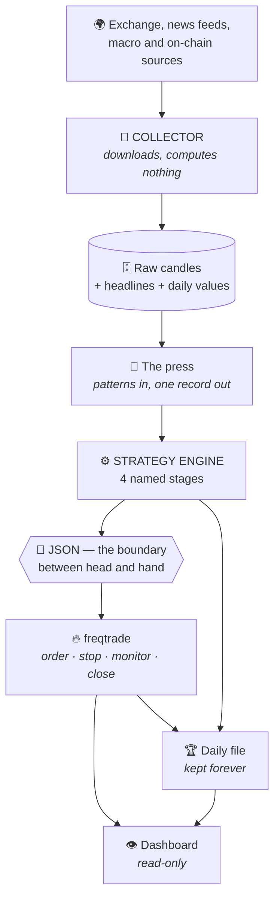

← [[START HERE]]

# 🔗 The chain — from a candle to a trade

Everything in ORBITRON is one chain with named parts. This page walks it end to end
in plain language. Each part has its own page for the details.

---

## The whole thing on one screen

---

## Step by step

### 1 · 📡 Collect — and compute nothing

A collector runs in the cloud and pulls, once a minute: spot and futures candles
from the exchange, RSS from news outlets and central banks, and the daily macro and
on-chain values.

Its job description is one sentence, and the second half matters more than the first:

> **It downloads and writes. It does not calculate anything.**

Why that discipline? Because the collector lives on the machine most exposed to the
internet. A machine that only fetches and stores has nothing valuable to steal and
is *acceptable to lose*. Anything more expensive than "fetch and write" runs
elsewhere. See [[The three machines]].

### 2 · 🔧 The press — patterns become one record

Raw candles reach **the press** (internally: *the slot*) — one fixed machine that
accepts any number of patterns and produces records in exactly one format.

This is the project's founding analogy and it earns its own page: [[The tomato press]].

The output of this stage is a bare signal: *which pattern, when, direction, price,
strength*. Nothing about the world it happened in.

### 3 · ⚙️ The engine — four named stages

The signal now enters the **STRATEGY ENGINE**, which is the heart of the project.
It has four stages, and they have names rather than numbers, for a reason explained
on its own page:

| Stage | The question it answers |
|---|---|
| 🛰️ **lost in space** | did something happen? |
| 🏠 **found home** | in what kind of world did it happen? |
| 🎓 **back to school** | **trade or not — and what kind?** |
| 🔥 **in fire** | what happened to it? |

Full detail: [[STRATEGY ENGINE]].

### 4 · 📜 JSON — the boundary

Stage 3 outputs **JSON**. Not a function call, not an in-memory object — a
writable, readable, comparable format.

This is the single most consequential design choice in the project, and
[[The detachable tool]] explains why: a different executing bot means a different
*reader of the same JSON*. The engine does not know who executes it and has no way
to find out.

### 5 · 🔥 Execution — borrowed, on purpose

**[freqtrade](https://www.freqtrade.io)** — an open-source trading bot — sends the
order, keeps the stop at the exchange, monitors the position and closes it. That
software is **not ours and is not touched** — we extend it only through the extension points it provides.

Why borrow this part specifically: [[The head and the hand]].

### 6 · 🏆 The day is written down — forever

At the end of every day, one Markdown file records what the market did, the
strongest moves, every signal with its follow-up result, a per-pattern summary, and
a system-health section.

Those files are never rotated and never deleted.

> Raw candles can be re-downloaded from the exchange at any time.
> **The explanation of a day cannot.**

That is [[The golden archive]], and it is the part of this project most likely to
matter in five years.

---

## The one boundary people get wrong

Three different actors decide three different things, and collapsing them is the
most common misreading of the whole design:

| Who | Decides |
|---|---|
| **the pattern** | *whether* something happened at all |
| **the engine** | *whether there is a trade, and what kind* |
| **freqtrade** | sending it, holding the stop, watching, closing |
| **the operator** | and only the operator — turning a paper trade into a real one |

---

## 🔗 Related

[[The head and the hand]] · [[The tomato press]] · [[STRATEGY ENGINE]] · [[The three machines]] · [[The golden archive]]
