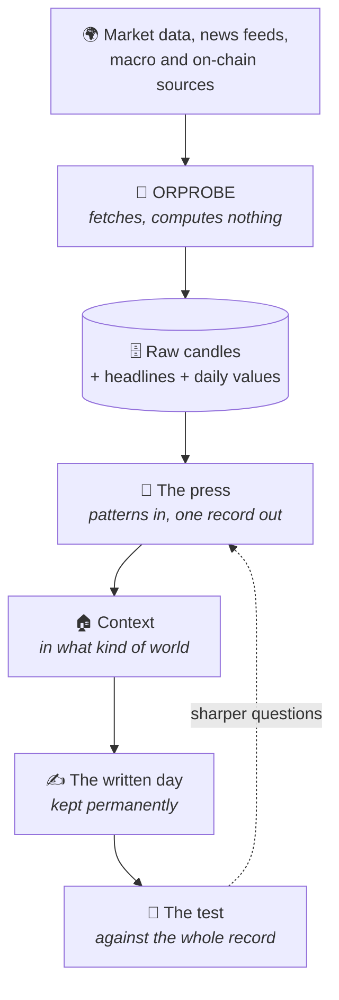

← [START HERE](../START%20HERE.md)

# 🔗 The chain — from a candle to a written day

Everything here is one chain with named parts. This page walks it end to end in
plain language.

---

## The whole thing on one screen

---

## Step by step

### 1 · 📡 Collect — and compute nothing

A collector runs in the cloud and pulls, once a minute: price candles, RSS from news
outlets and central banks, and the daily macro and on-chain values.

Its job description is one sentence, and the second half matters more than the first:

> **It fetches and writes. It does not calculate anything.**

Why that discipline? Because the collector lives on the machine most exposed to the
internet. A machine that only fetches and stores has nothing valuable on it and is
*acceptable to lose*. Anything more expensive than "fetch and write" runs elsewhere.

### 2 · 🔧 The press — patterns become one record

Raw candles reach **the press** (internally: *the slot*) — one fixed machine that
accepts any number of patterns and produces records in exactly one format.

This is the project's founding analogy and it earns its own page:
[The tomato press](The%20tomato%20press.md).

The output of this stage is a bare observation: *which pattern, when, direction,
price, strength*. Nothing yet about the world it happened in.

### 3 · 🏠 Context — in what kind of world did it happen

The bare observation is then dressed in the context of the day: the macro regime,
the risk appetite, the scheduled releases, the news, where capital was flowing.

This is the step that turns a number into an event, and it is the whole reason the
project bothers with fundamentals at all:

> **The same technical state means different things under different liquidity, a
> different macro backdrop, a different mood.**

See [Market regimes](../02%20%E2%80%94%20THE%20RESEARCH/Market%20regimes.md) and
[Smart money track](../02%20%E2%80%94%20THE%20RESEARCH/Smart%20money%20track.md).

### 4 · ✍️ The day is written down — permanently

At the end of every day, one Markdown file records what the market did, the
strongest moves, every observation with its follow-up result, a per-pattern summary,
and a system-health section.

Those files are never rotated and never deleted.

> Price data can be re-downloaded at any time.
> **The explanation of a day cannot.**

That is [The eternal archive](../02%20%E2%80%94%20THE%20RESEARCH/The%20eternal%20archive.md),
and it is the part of this project most likely to matter in five years.

### 5 · 🧪 The test — and the loop closes

Once enough days have accumulated, a proposed answer can be measured against the
whole record: compared with what chance alone produces, after costs, corrected for
asking many questions at once.

An answer that survives sharpens the next question. An answer that does not is
recorded as a negative result and the belief is dropped — see
[The v2 validation engine](../04%20%E2%80%94%20THE%20ENGINEERING/The%20v2%20validation%20engine.md).

---

## Where the truth lives

One boundary worth stating, because it explains a lot of the design:

| Who | Holds |
|---|---|
| **the collector** | nothing but what it fetched |
| **the database** | the raw observations, permanently |
| **the written day** | the explanation, written once and never regenerated |
| **the operator** | every decision, without exception |

The last row does not move. **No part of this system acts on its own.**

---

## 🔗 Related

[The tomato press](The%20tomato%20press.md) · [The eternal archive](../02%20%E2%80%94%20THE%20RESEARCH/The%20eternal%20archive.md) · [The daily file](../02%20%E2%80%94%20THE%20RESEARCH/The%20daily%20file.md) · [Repositories](../04%20%E2%80%94%20THE%20ENGINEERING/Repositories.md)
