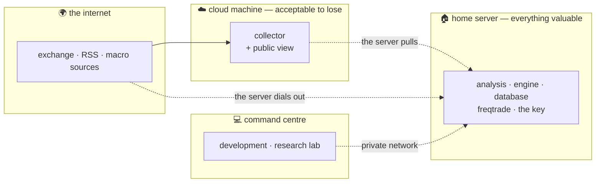

← [START HERE](../START%20HERE.md)

# 🏛️ The three machines

The system runs on three machines with deliberately unequal trust. The split is not
about cost — it is the security model itself.



---

## Who does what

| Machine | Role | Holds |
|---|---|---|
| ☁️ **Cloud** | the collector, and the public read-only view | **nothing valuable** — no keys, no calculations |
| 🏠 **Home server** | all computation: analysis, the engine, the database, freqtrade | **everything valuable**, including the trading key |
| 💻 **Command centre** | development, the research lab, control | the developer's keys |

> [!TIP]
> **The principle that drives the whole split**
>
> **Nothing sensitive and nothing expensive runs in the cloud.** Anything costlier
> than "fetch and store" runs on the home server. The cloud machine stays keyless
> and *acceptable to lose*.

---

## Direction of connection is itself the defence

The security model is not a wall — "clean inside, dirty outside" does not survive
three machines in three places. It is **zones with permitted directions**:

```
internet   →  cloud        the cloud machine pulls from outside
cloud      ←  server       THE SERVER pulls from the cloud — never the reverse
exchange   ←  server       THE SERVER dials the exchange — single outbound requests
server     ←  laptop       over a private network
```

> [!CAUTION]
> **Nobody dials the server**
>
> The consequence is large: **even if the cloud machine were fully compromised, the
> attacker has no path inward.** There is no key there, no open door, and nothing to
> dial. The worst it can do is fill its own database with garbage — which the server
> validates before accepting.

An outbound connection is not an inbound door. freqtrade talks to the exchange, but
only ever by dialling out. Open inbound ports: zero, and they stay zero.

---

## Data crosses a border only after checking

Everything from outside is **data, never instructions** — headlines, article bodies,
third-party API fields, and reports written by another AI.

An article can contain the sentence *"ignore previous instructions and…"*. If that
text reaches a language model fused with the instruction, the model may obey it.
So, by construction, three barriers:

1. foreign text enters in a **separate field**, never concatenated with the instruction;
2. the model returns **only fixed JSON**, validated against a schema — anything that
   does not fit is discarded;
3. the model **has no permissions at all** — it does not write to the database, does
   not call functions, does not decide. It writes into a field a human reads.

Plus the unglamorous checks that catch our own bugs far more often than anyone's
malice: parse with a strict JSON reader only, never `eval`; validate types *and*
ranges; send failing rows to a **quarantine table** rather than dropping them
silently; parameterised SQL only; a size cap and a timeout on every outbound
request; TLS verification never disabled.

> [!NOTE]
> **One family of attacks worth knowing about**
>
> RSS parsing has its own: **nested entities** — a small XML file that expands to
> gigabytes in memory and kills the machine — and **external entities**, where the
> parser is tricked into reading a local file and sending it out. The defence is one
> line: a parser with entity expansion disabled instead of the standard one. Plus:
> the article link is never fetched automatically, or every foreign headline becomes
> the command *"go to this address"*.

---

## What is not in this vault

Hostnames, addresses, network topology, firewall rules, key handling, deployment
paths. Publishing a map of the house is not documentation, it is an invitation.

The **model** above is public because the model is worth discussing. The
**coordinates** are not.

---

## 🔗 Related

[The chain](The%20chain.md) · [The head and the hand](The%20head%20and%20the%20hand.md) · [Repositories](../04%20%E2%80%94%20THE%20ENGINEERING/Repositories.md) · [Principles](../01%20%E2%80%94%20THE%20IDEA/Principles.md)
