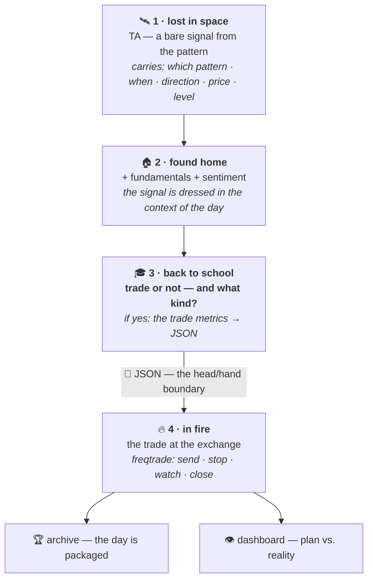

← [START HERE](../START%20HERE.md)

# ⚙️ STRATEGY ENGINE

> [!NOTE]
> **The heart of the project**
>
> The four stages between a bare signal and a live trade — and one output that is a
> **format**, not a function call.

Until this was named, the chain was described as a sequence of participants:
pattern → press → risk calculation → bot. Now it has a name, four stages, and a
boundary.

**The engine is not a layer that connects the other layers. It is the reason the
other layers exist.**

---

## The four stages



| Stage | The question it answers | Served by |
|---|---|---|
| 🛰️ **lost in space** | "did something happen" | the pattern + the press |
| 🏠 **found home** | "in what kind of world did it happen" | the daily file, fundamentals, sentiment |
| 🎓 **back to school** | **"trade or not — and what kind"** | the engine |
| 🔥 **in fire** | "what happened to it" | freqtrade |

---

## Why the stages have names instead of numbers

> A number is remembered as an *order*. A name is remembered as a **place**.

*"663 entries disappeared between the bridge and the bot"* is a sentence without an
address. *"663 disappeared between `found home` and `back to school`"* points at
where to look.

That is not a stylistic preference — it came from a real incident where a bridge
produced 720 entries and 57 trades resulted, and nobody could say where the rest
went, because the parts in between had no names.

The practical payoff is the same one: four stages mean **three internal measurement
points**, each of which can fail separately.

---

## 🎓 Stage 3 — the most critical environment in the project

One question. Only one:

> ### trade or not?

If the answer is **no** — the chain stops here and *why* is recorded.
If **yes** — the trade metrics are written and JSON goes to freqtrade.

### The refusal is also a record

> **A signal refused without a recorded reason is a lost observation.** A year later
> *"why didn't we enter then"* becomes a question nobody can answer.

Refusals carry the same schema as executions, with a mandatory reason field. This
is not bureaucracy — it is half the data.

### What the missing default is

Missing field, unknown combination, unread context → **`reject`**. Never "assume
it's fine".

That is not caution for its own sake, it is a lesson already paid for: a reader that
treated a missing folder as "no data" stayed silent for days.

### The three rules that survive even here

The engine is deliberately a zone without fixed foundations — a hypothesis inside it
needs a measurement, not an approval. But three things do not bend:

| Rule | What it looks like at this stage |
|---|---|
| **No looking into the future** | not one line computes with data that did not exist at that moment. This is the mistake that most quietly destroys backtests |
| **A metric without a baseline is advertising** | every number answers "compared to what". "Compared to nothing" voids it |
| **A number that doesn't add up gets checked** | an arithmetically impossible result stops the work |

> [!CAUTION]
> **And the boundary of the whole stage**
>
> **The engine decides whether there is a trade. It does not decide whether that
> trade is real.** Every trade born here is a paper trade. Turning it real is the
> operator's decision, and only the operator's.

---

## The four levers — and why they are not summed

The obvious design is a weighted sum: `score = W₁×FA + W₂×TA + W₃×sentiment`.
It is rejected, and the reason is the actual finding of this design:

> **Each lever acts by a different mechanism. Addition assumes they all do the same
> thing, only with different strength.**

| Lever | Mechanism |
|---|---|
| 🌍 **Macro regime** | **a hard gate** — does not add or subtract points. It permits or blocks |
| 📰 **Sentiment** | **a multiplier on acceleration** — does not decide direction, amplifies one already taken. Neutral does not subtract; it simply does not add |
| 🐋 **Smart money** | **a stop-tightener** — does not touch confidence at all |
| 💰 **Funding** | **a tax brake** — subtracts, never adds |

Collapse those four into one number and the finding disappears silently.

### The one worth dwelling on

**Smart money tightens the stop rather than raising confidence**, and the difference
is not cosmetic:

- Raised confidence → larger size → **more risk**.
- A tightened stop → **the same risk over a shorter distance** → a smaller loss when
  we are wrong.

And the arithmetic says the same thing: leverage is a *result* of risk and
stop distance. Tighten the stop at constant risk and leverage rises — so the lever
is not free, and the risk-management ceiling still applies above it.

### The order they run in

```
1. state table       →  is this direction permitted at all?   no → block, done
2. hard gate (macro) →  does it contradict?                   yes → block, done
3. sentiment         →  multiplies confidence
4. funding           →  subtracts from confidence
5. confidence → tier →  the tier feeds risk management
6. smart money       →  tightens the stop
```

Note that smart money is **last and outside the confidence calculation** — it enters
as a parameter of the trade, not as a vote on it.

---

## 🚦 The state table — the first gate

Before anything is weighed, one question: **is a trade in this direction permitted
at all?**

Three inputs, and they deliberately do not collapse into one number:

| Input | What it is | Tempo |
|---|---|---|
| **Macro quadrant** | growth × inflation → four canonical regimes | **months** |
| **Risk axis** | a continuous score from published indices | **days** |
| **Volatility** | the context the move happened in | **minutes–hours** |

> [!CAUTION]
> **The disagreement between the slow and the fast is information, not error**
>
> That is precisely where a scalp lives. Merge them into one number and that
> information vanishes without a sound.

Three rules the table carries:

1. **An unmatched combination falls to "no".** There is no implicit "both
   directions". A combination with no row returns `none` and the reason
   `"no matching state"`.
2. **A borderline month is a cell like any other.** When two macro definitions
   disagree, `quadrant_agreed` is `False` and no regime is asserted. That is a row
   in the table, not a hole in it.
3. **A hard block is its own field, not a very negative score.** A block carries a
   *reason*; a low score carries only a number.

> [!TIP]
> **Why a table and not nested conditionals**
>
> A table is read by a human and compared against yesterday's. Sixteen cells inside
> nested `if`s are read by nobody — including the person who wrote them.
>
> And second: a table is **data**. Data has a version, travels in the passport, and
> changes without touching code.

> [!WARNING]
> **The easiest place in the project to invent a threshold**
>
> A number written by eye looks exactly like a number extracted from data, and no
> line of code complains. So the table enters the vault **empty of values and full
> of structure**, and filling it is separate work involving measurement.

---

## 📜 The output: a decision passport

Stage 3 emits a **passport** — the contract between the head and the hand. Its rules:

1. **A refusal is also a passport**, with its reason.
2. **The default is NO.**
3. **The schema has a version** — `schema_version` is the first field. Without it,
   "a file from six months ago is read by today's reader" is a wish, not a requirement.
4. **The passport carries no regime *names* in logic.** The core reads fields, not
   labels. The regime's name is for the human and the dashboard; the code works with
   the axes.

The schema is published **with types and without values** — because invented numbers
in a document are the same defect as invented data in a test, and calibrated values
do not exist yet.

```python
PASSPORT = {
    "schema_version": str,        # "1.0" — first field, always
    "passport_id":    str,
    "created_at":     str,        # ISO 8601, UTC

    "signal": {                   # ← from stage 1
        "pattern_id":      str,
        "pattern_version": str,
        "timestamp":       str,   # the candle's time, not the processing time
        "direction":       str,   # "long" | "short"
        "score":           int,
        "max_score":       int,   # the scale, copied from the pattern's passport
    },

    "state": {                    # ← from stage 2
        "macro_quadrant":  str,
        "quadrant_agreed": bool,  # False = borderline month, no regime asserted
        "risk_axis":       float, # a continuous score, not a threshold
        "volatility":      float,
    },

    "decision":      str,         # "execute" | "reject"
    "reject_reason": str | None,  # mandatory on reject

    "gate":   { "allowed_side": str, "protocol": str, "hard_block": bool },
    "levers": { ... },            # each lever: value + what it did
    "confidence": str,            # the tier, not a raw number

    "trade": { ... } | None,      # the metrics; None on reject
    "enter_tag": str,             # the compressed rationale — see below
}
```

### `enter_tag` — the rationale travels with the trade

freqtrade has a field for naming an entry signal (`enter_tag`) ✅ **verified in its
documentation**. We fill it with a compressed passport:

```
A001|R:refl|RISK:+0.4|SM:1|FND:-1|C:med
```

Three gains, and the third is the real one:

| Gain | Why |
|---|---|
| zero new software | the field already exists in freqtrade and in its UI |
| the rationale survives to freqtrade | otherwise a trade in its UI is a mute row |
| ⭐ **it survives into the backtest** | results group **by reason for entry** — an analysis not otherwise possible |

The tag is a **pointer, not a record**: the truth lives in our database, the tag
carries only enough to recognise the row.

---

## 🔓 One deliberate exception to every rule

The rest of the project runs on "every statement carries a date and a reason".
Inside the strategy engine, it deliberately does not:

> *"There is nothing fixed here, no eternal foundations and no rules. We gather all
> the context from collectors and patterns, and we build and test strategies."*

| Where | Mode |
|---|---|
| formats · schemas · names · chains · decisions | **frozen** — changed by a dated decision |
| inside the strategy engine | **free** — changed because someone had an idea |

**The frame is rigid so that the engine can be soft.** An experiment that must pass
an approval is not an experiment.

Two things still hold inside: the *output* — the JSON format and the metrics in it —
requires approval, and the measure of truth does not drop. No looking into the
future, no metric without a baseline.

---

## ⚠️ What is not being claimed

- **None of stage 3 exists as code.** This describes an environment that is ahead of us.
- **Not one threshold or weight is calibrated.**
- The confidence tiers are not defined.
- "Smart money zones" have no written definition yet.
- Bitcoin's behaviour by macro quadrant is a **hypothesis, not knowledge** — bitcoin
  has lived through roughly one macro cycle, and one cycle proves nothing.
- The structure of the levers came from third-party material and was assessed as
  **data, not accepted as truth**. The mechanisms were taken; the weights and
  thresholds were not, because there was no measurement behind them.

---

## 🔗 Related

[The chain](../03%20%E2%80%94%20THE%20SYSTEM/The%20chain.md) · [The detachable tool](The%20detachable%20tool.md) · [Contracts and formats](Contracts%20and%20formats.md) · [Market regimes](../02%20%E2%80%94%20THE%20RESEARCH/Market%20regimes.md) · [Smart money track](../02%20%E2%80%94%20THE%20RESEARCH/Smart%20money%20track.md)
