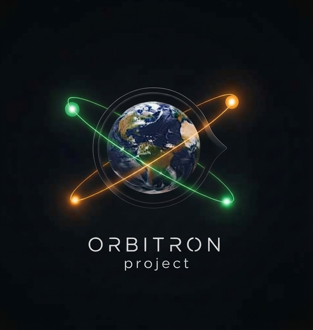
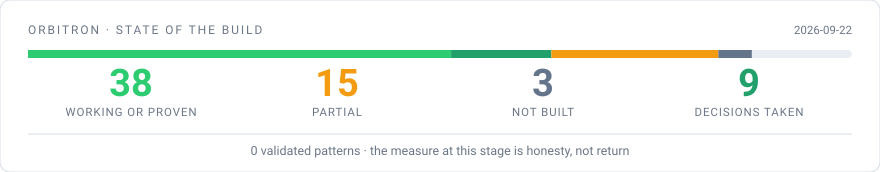
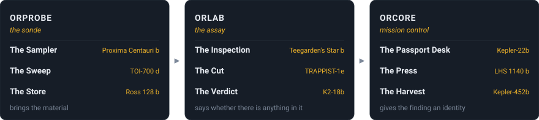
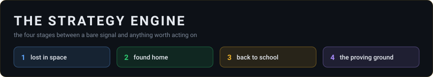
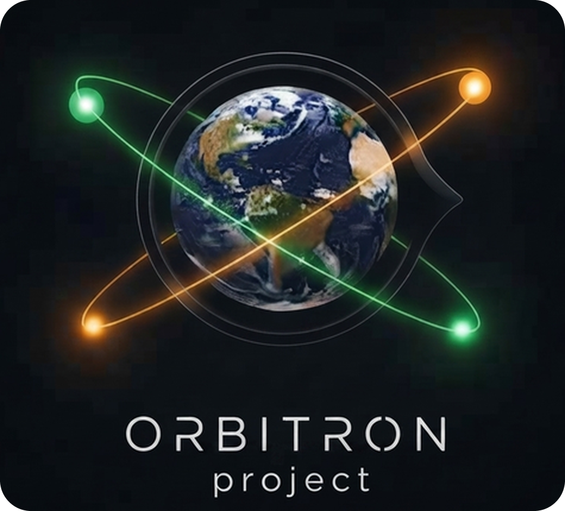

<div align="center">



# ORBITRON — public vault

<picture>
  <source media="(prefers-color-scheme: dark)" srcset="assets/tagline-dark.svg">
  
</picture>

**We look for answers. We ask why. We write the day down — permanently.**

[](https://github.com/orbilob/orbitron-public/actions/workflows/vault.yml)
[](LICENSE)
[](01%20%E2%80%94%20THE%20IDEA/Why%20this%20exists.md)
[](https://obsidian.md)

**The stack**

[](https://www.python.org)
[](https://sqlite.org)
[](https://pandas.pydata.org)
[](https://numpy.org)
[](https://scipy.org)

**Made by**

[](https://github.com/orbilob)
[](https://claude.com/claude-code)
[](05%20%E2%80%94%20HOW%20WE%20WORK/Working%20with%20an%20AI%20agent.md)

</div>

---

<!-- board:start -->
<div align="center">

<picture>
  <source media="(prefers-color-scheme: dark)" srcset="assets/board-dark.svg">
  
</picture>

**39** working or proven &nbsp;·&nbsp; **15** partial &nbsp;·&nbsp; **3** not built &nbsp;·&nbsp; **9** decisions taken &nbsp;·&nbsp; **0** validated patterns

<sub>Generated from the project's live board on 2026-09-24 — not written by hand. The bar spans all 75 tracked rows; its unfilled tail is work that is deferred, archived or deliberately closed.</sub>

&nbsp;

**The chain**

<picture>
  <source media="(prefers-color-scheme: dark)" srcset="assets/chain-dark.svg">
  
</picture>

**ORPROBE** *the sonde* &nbsp;▸&nbsp; **ORLAB** *the assay* &nbsp;▸&nbsp; **ORCORE** *mission control*

<sub>The Sampler ▸ The Sweep ▸ The Store &nbsp;·&nbsp; The Inspection ▸ The Cut ▸ The Verdict &nbsp;·&nbsp; The Passport Desk ▸ The Press ▸ The Harvest</sub>

&nbsp;

<picture>
  <source media="(prefers-color-scheme: dark)" srcset="assets/engine-dark.svg">
  
</picture>

<sub>**1** lost in space &nbsp;·&nbsp; **2** found home &nbsp;·&nbsp; **3** back to school &nbsp;·&nbsp; **4** the proving ground</sub>

**→ [How the chain works](04%20%E2%80%94%20THE%20ENGINEERING/The%20chain%20of%20three.md)**

&nbsp;

**The named pattern classes**

<picture>
  <source media="(prefers-color-scheme: dark)" srcset="assets/patterns-dark.svg">
  
</picture>

**Madriu** v0.1 &nbsp;·&nbsp; **Xolotl** v0.1 &nbsp;·&nbsp; **Hypatia** v0.1 &nbsp;·&nbsp; **Awohali** v0.1 &nbsp;·&nbsp; **Draugr** v0.1

<sub>Named after real exoplanets — one planet, one class. Five classes are designed; none measured yet, and what each one looks for is not published. **The project is in active development.**</sub>

</div>
<!-- board:end -->

<div align="center">


</div>

---

### **We are looking for answers.**

Not for predictions, and not for a system that acts on anyone's behalf. For an answer
to one question, asked again every single day:

> ## Why did the trend move in this direction, in this market regime — and what was happening behind the scenes?

Markets never stop changing. What explained last quarter stops explaining this one,
and usually nobody can say exactly when it stopped or why. Explanations arrive
afterwards, confidently, and cannot be checked.

So this project does two things instead.

**It asks why** — what makes a move start, what sustains it, what kills it, which
levers are being pulled, and where capital goes when it leaves somewhere else.

**And it writes the answer down.** Day after day, building a history that did not
exist before: not only what the price did, but what the world looked like while it
did it. Written once, in the moment, and kept permanently.

That record is the actual product. Not a conclusion — **a history**, honestly kept,
against which future answers can be tested by an instrument built so that it **can
come back negative**.

**→ [Why this exists](01%20%E2%80%94%20THE%20IDEA/Why%20this%20exists.md)** — the full
argument, in five minutes.

---

## 🏆 The part that matters most

> **Raw candles can be re-downloaded from the venue at any time.
> The explanation of a day cannot.**

Every day is recorded as a single image — the macro backdrop, the flows, the mood,
what was known and what wasn't — written once, in the moment, and kept **forever**.
A daily file weighs a few kilobytes; a century of them weighs less than one day of
raw candles.

It makes a question possible that cannot be asked today:

> *"Find me the days whose macro image resembles today's — how did this mechanism
> behave then?"*

Only someone who started keeping the record years earlier can ask it.
→ [The eternal archive](02%20%E2%80%94%20THE%20RESEARCH/The%20eternal%20archive.md)

---

## 🚪 Where to start

This is an **[Obsidian](https://obsidian.md) vault**. Clone it and open the folder as
a vault, or just read it here on GitHub — the folder names are the table of contents
and every link works in both.

| You are | Start here | Time |
|---|---|---|
| 🧑 Curious, non-technical | [Why this exists](01%20%E2%80%94%20THE%20IDEA/Why%20this%20exists.md) | 5 min |
| 🔬 Interested in method | **02 — THE RESEARCH** and [The v2 validation engine](04%20%E2%80%94%20THE%20ENGINEERING/The%20v2%20validation%20engine.md) | 15 min |
| 🧑‍💻 A developer | [The chain of three](04%20%E2%80%94%20THE%20ENGINEERING/The%20chain%20of%20three.md), then **05 — HOW WE WORK** | 20 min |

Full map: **[START HERE](START%20HERE.md)**

```
01 — THE IDEA          why this exists · what it is and is not · principles
02 — THE RESEARCH      the permanent archive · regimes · smart money · the daily file
03 — THE SYSTEM        how observation becomes a testable claim
04 — THE ENGINEERING   the chain of three, contracts, statistics, honest boundaries
05 — HOW WE WORK       ⭐ the discipline: decisions, evidence labels, guards
```

---

## ⚠️ Disclaimer

**ORBITRON is personal research. Nothing here is financial advice.**

- It does not sell signals, subscriptions, copy-market or a course.
- It does not manage anyone else's money, and never will.
- **No claim of profitability is made anywhere in this vault.** The measure of
  success at this stage is honesty, not return.
- Any numbers you find are illustrations of method, not a track record.
- Large parts of what is described here are **designed, not built** — and where that
  is the case, the documents say so in a section titled *"what is not being claimed"*.

If you came looking for a system that makes money, this is the wrong repository.
If you came looking for how someone tries to understand a system that refuses to hold
still — welcome.

---

## 🔒 What is deliberately not here

Infrastructure details, network layout, hostnames, credentials, calibrated
thresholds, scoring weights, and the pattern code itself.

**What is shown is how the project thinks. What is withheld is what it acts on.**

---

## 📄 License & authorship

**Built with Claude Code, under the idea, direction and supervision of the author —
[orbilob](https://github.com/orbilob).**

The project is his: the questions it asks, the decisions it records, and the
judgement behind every one of them. The agent reads, drafts and implements under
the project's own written rules — see
[Working with an AI agent](05%20%E2%80%94%20HOW%20WE%20WORK/Working%20with%20an%20AI%20agent.md).

Licensed under [CC BY-NC 4.0](LICENSE) — read it, share it, quote it with credit;
don't sell it.

<div align="center">



</div>
